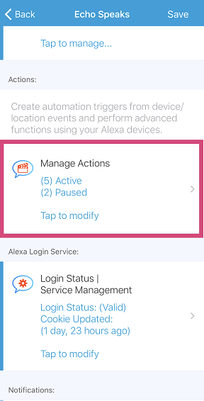
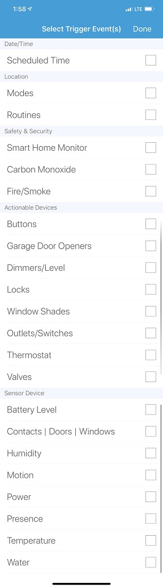
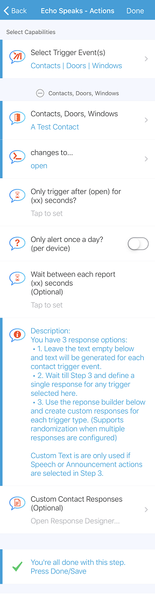
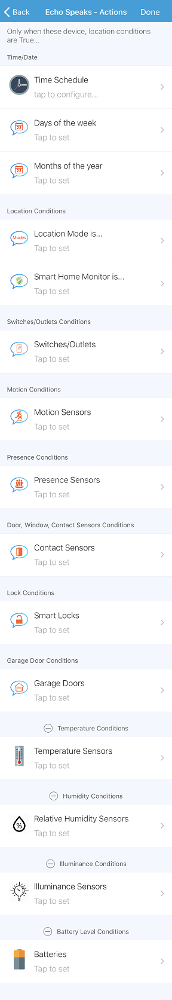
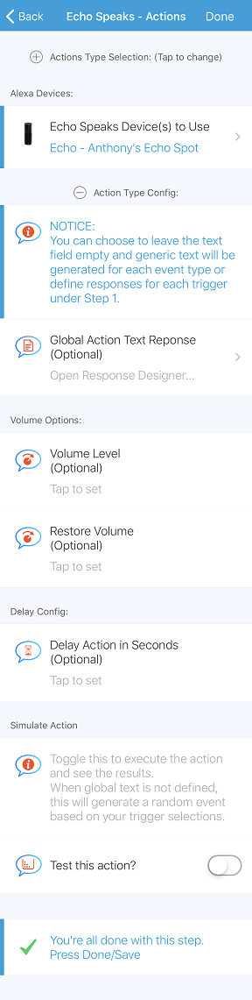

## <h2>Action Config Options</h2>

----

An action is broken into 3 configuration steps:
### <h3 style="color: #FF6025;">Create New Action:</h3>

* Under the **Echo Speaks App** tap on `Manage Actions`

    

* Tap on `Create New Action`

    

----

### <h3 style="color: #FF6025;">Step 1: Configure Action Type</h3>

  Select the action type that will be executed by the triggers selected.

* Tap on `Action Type`.

    

*  Select the desired Action Type.

    

* Move of to Step 2.

----
### <h3 style="color: #FF6025;">Step 2: Configure Trigger Events</h3>

  * Tap on `Action Triggers`.

    

  * Tap on Select Trigger Events

    

  * Select your trigger types (Multiple Allowed) and press `Done`.

    

  * You will be shown a config section for each trigger selected.

       

   * Select the devices to subscribe to for the trigger type.
   * Confuring the `Changes to?` option.

    ***Note: Selecting *any* for the changes to input will prevent you from using the monitoring features.***

    * If you selected any you will see these options:

        

    * Otherwise you see:

        

    * If you choose to configure the Only after options:

        **Note:** You can configure an additional repeat every (xx) seconds until the trigger value changes. When repeat after is configured you will see a new input for custom repeat response items.

        **Note:** Entering multiple responses in any of the triggers custom response will enable random response selection per event trigger type.

        

        

    * Press `Done/Save` to return to main action config page

### <h3 style="color: #FF6025;">Step 3: Configure Conditions/Restrictions</h3>

**Note:** Conditions are optional and just help fine tune when a action can execute.

**Note:** Think of these conditions as the gate keeper.  All conditions have to pass as a whole, meaning the more conditions the more strict your action will be to execute.

* Tap on `Conditions/Restrictions`.

    

* Configure any desired conditions.

* Press `Done/Save` to return to main action config page

----

### <h3 style="color: #FF6025;">Step 4: Configure Action Execution</h3>

* Tap on `Execution Config` in Step 4.

    

  This is where the desired Echo Devices are selected.

* Once the action type is selected you will see:

    

* Now select your echo devices to execute the action on.

    **Note:** The echo device list is populated based on device capability and the selected action type.

    

* You can now configure the remaining options.

    **Note:** The action type config options are different for each action type. So may see something different than the photo below.

    

  **Note:** When Speak and Announcement types are selected you will see a Global Action Text Response input.  This can be confusing seeing as you may or may not have configured responses under the triggers.
  Think of the global response as the output for any and all triggers meaning no matter the trigger it will always use these responses even if responses are defined under triggers.  But if you leave this blank it will either use the individual trigger responses or generate a generic response based on the event.

  **Option:** Volume Options may be shown based on the selected Action Type.

  **Option:** Delay Action allows you to delay the execution (xx) seconds.

* Once your all configured you can toggle the `Test this Action?` to simulate the action.

    **NOTE:** When no responses are defined the app will use all of the selected trigger types and values to randomly generate an event response to perform the test speech.

* Press `Done/Save` to return to the main action page.

* You can review the configuration descriptions and Press `Next` when ready.

* Now all that remains is to give the action a name.

    

* Press `Done/Save` to complete the creation of the new Action.

