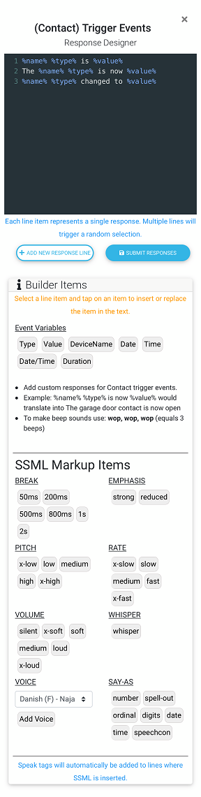
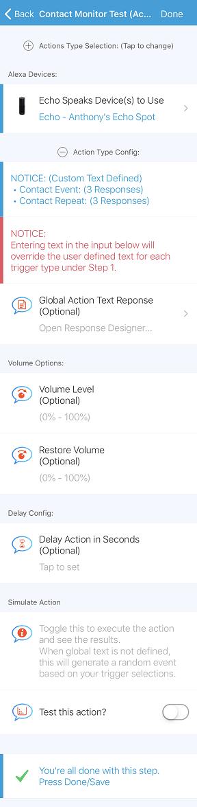
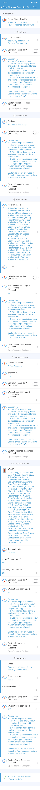

## <h2 class="doc-head">Example Actions</h2>

----

### <h3 class="doc-head">Contact Monitor Example:</h3>

*This example subscribes to contact events. It's purpose is to monitor a contact and perform an action if it's in the trigger state for (xx) seconds, and has a repeat speech event if the contact trigger remains in the open state.*

#### <h4>Config Details:</h4>

 

***Trigger Config:***

   

  - In this example i've defined the custom trigger responses for both the after (xx) event as well as the repeat response.  This will allow the action to use a random response for both the trigger and repeat events.

    Trigger & Repeat Event Responses:

     

***Condition Config:***

  - No Conditions Defined

***Action Execution Config:***

   - No global responses were configured here.

    

----
### <h3 class="doc-head">Complex Example:</h3>

*This example subscribes to presense, power, temperature, motion attributes, routine and location mode execution. With each trigger type having it's own criteria for the attributes trigger value, wait, and custom voice responses (only available when Step 3 type is speech or announcement).*

#### <h4>Config Details:</h4>

  

***Trigger Config:***

- In this example i've left the custom trigger responses empty.  This will allow the action to generate a basic response based on the trigger event.
- If you choose to add custom responses you can add multiple items using the response designer.  When multiple responses are given a random one is selected for each event.

    **Note:** This is a really long screenshot (That's just a testiment to how many triggers a single action can handle)

    

***Condition Config:***

  - Time Conditions
  - Location Conditions
    - Alarm (HSM/SHM Modes) Condition
    - Location Mode Condition
  - Contact Closed Condition

    

***Action Execution Config:***

   - No global responses were configured here.

    

----
### <h3 class="doc-head">Contact Monitor Example:</h3>

*This example subscribes to contact events. It's purpose is to monitor a contact and perform an action if it's in the trigger state for (xx) seconds, and has a repeat speech event if the contact trigger remains in the open state.*

#### <h4>Config Details:</h4>

 

***Trigger Config:***

   

  - In this example i've defined the custom trigger responses for both the after (xx) event as well as the repeat response.  This will allow the action to use a random response for both the trigger and repeat events.

    Trigger & Repeat Event Responses:

     

***Condition Config:***

  - No Conditions Defined

***Action Execution Config:***

   - No global responses were configured here.

    

