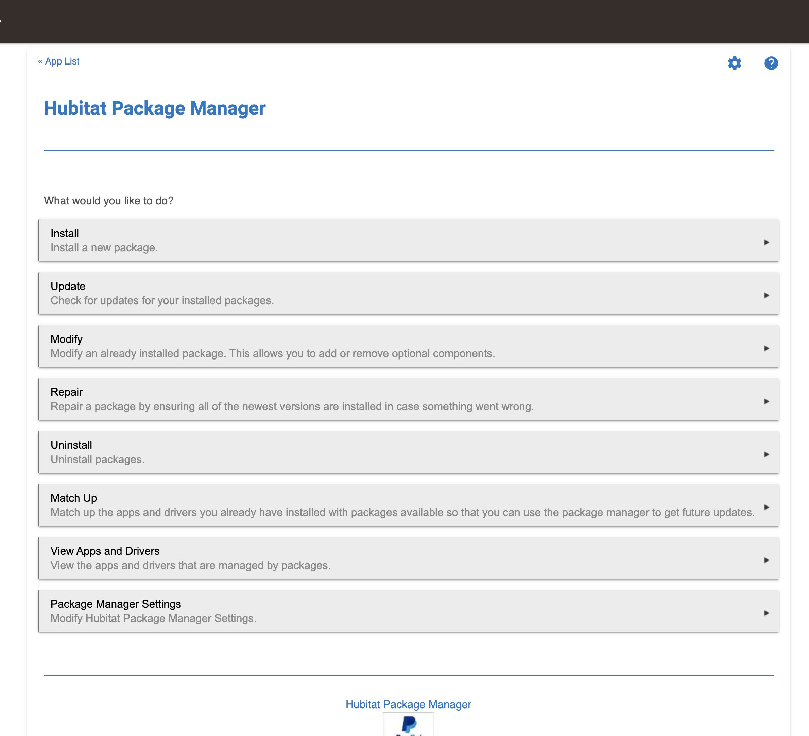

### <h3 style="color: #FF6025;">Step 1:</h3>

Navigate to the Apps Section of the by clicking on **`Apps`** tab at the left of your screen:

---
### <h3 style="color: #FF6025;">Step 2:</h3>

Click on **`Hubitat Package Manager`**

If not installed please visit this page to get it installed: [https://community.hubitat.com/t/beta-hubitat-package-manager/38016](https://community.hubitat.com/t/beta-hubitat-package-manager/38016)

---
### <h3 style="color: #FF6025;">Step 3:</h3>

Click on the `Install` button:

---
### <h3 style="color: #FF6025;">Step 4:</h3>

Click on Search by Keywords:

---
### <h3 style="color: #FF6025;">Step 5:</h3>

Enter the text `Echo Speaks`, click on `Next`, select the Echo Speaks by A. Santilli and click `Next` once more.

---
### <h3 style="color: #FF6025;">Step 6:</h3>

Proceed through the remaining steps until it completes the install.

---
### <h3 style="color: #FF6025;">Step 7:</h3>

Continue with App Configuration Here:

[App Configuration](./hubitat/configuration/config_app/)
