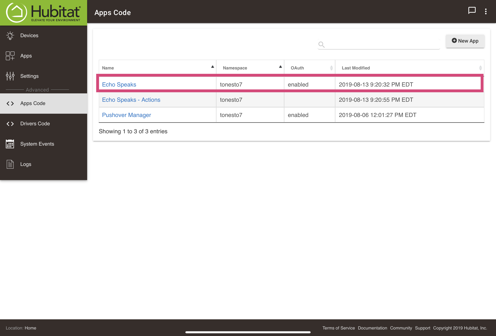

### <h3 class="doc-head">Step 1:</h3>
Proceed to your Hubitat Dashboard

---
### <h3 class="doc-head">Step 2:</h3>
Navigate to the Apps Code Section of the by clicking on **`Apps Code`** tab at the left of your screen:

---
### <h3 class="doc-head">Step 3:</h3>
Open the existing App code by clicking on the `Echo Speaks` app in the list of Apps.

---
### <h3 class="doc-head">Step 4:</h3>
Click on the `Import` button at the top of the page:

* Copy this URL into the window: `https://raw.githubusercontent.com/tonesto7/echo-speaks/master/apps/echo-speaks.groovy`
* Click `Import`
* Click `Save`

---
### <h3 class="doc-head">Step 5:</h3>
Repeat Steps 3 & 4 for the `Echo Speaks Actions` App: `https://raw.githubusercontent.com/tonesto7/echo-speaks/master/apps/echo-speaks-actions.groovy`

Repeat Steps 3 & 4 for the `Echo Speaks Zones` App: `https://raw.githubusercontent.com/tonesto7/echo-speaks/master/apps/echo-speaks-zones.groovy`

---
### <h3 class="doc-head">Step 6:</h3>

**You're done!!!**
