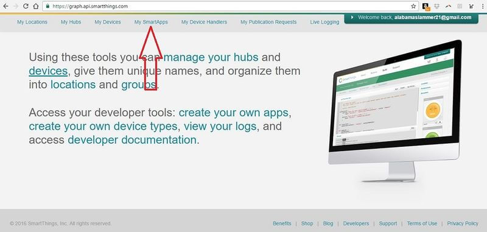

### <h3 style="color: #FF6025;">Step 1:</h3>
Log-in to the SmartThings IDE at [ST IDE](https://account.smartthings.com/login)

* Once you login ensure you are able to see your hub and devices under the Locations tab.
* ***These instruction assume that you have already registered an account on the SmartThings IDE website. Otherwise, please create the account before proceeding any further.***

---
### <h3 style="color: #FF6025;">Step 2:</h3>
Navigate to the SmartApps Section of the SmartThings IDE by clicking **`My SmartApps`** tab at the top of your screen:

---
### <h3 style="color: #FF6025;">Step 3:</h3>
Create a new smartapp by clicking on the  button found in the top right corner of this page:

---
### <h3 style="color: #FF6025;">Step 4:</h3>
Click on the  button found at the top of the screen:

---
### <h3 style="color: #FF6025;">Step 5:</h3>
You will now be at this page:

---
### <h3 style="color: #FF6025;">Step 6:</h3>
Copy the Echo Speaks source code from this link: [SmartApp Code](https://raw.githubusercontent.com/tonesto7/echo-speaks/master/smartapps/tonesto7/echo-speaks.src/echo-speaks.groovy)

* Press `CTRL+A` to Select all text and `CTRL+C` to Copy the selected text.
* Now paste it into the large white box on your screen with `CTRL+V`.
* Scroll to the bottom of the page and click on the ***`Create`*** button.

    

---
### <h3 style="color: #FF6025;">Step 7:</h3>
You will now see the screen below:

* Click on the **`Save`** button.
* After a few seconds click on the **`Publish`** button, and then click the **`For Me`** button.

    

---
### <h3 style="color: #FF6025;">Step 8:</h3>
You will now enable the SmartApps OAuth configuration. Please click on the **`App Settings`** button and scroll to the bottom of the next screen.

---
### <h3 style="color: #FF6025;">Step 9:</h3>
Click on the **OAuth** tab and then click the **`Enable OAuth in Smart App`** button as seen below:

---
### <h3 style="color: #FF6025;">Step 10:</h3>
Finally, click on **`Update`**.

---
### <h3 style="color: #FF6025;">Step 11:</h3>
Repeat Steps 3 to 7 for the Actions Child App: [Action Child App Code](https://raw.githubusercontent.com/tonesto7/echo-speaks/master/smartapps/tonesto7/echo-speaks-actions.src/echo-speaks-actions.groovy)
Repeat Steps 3 to 7 for the Zone Child App: [Action Child App Code](https://raw.githubusercontent.com/tonesto7/echo-speaks/master/smartapps/tonesto7/echo-speaks-zones.src/echo-speaks-zones.groovy)

---
### <h3 style="color: #FF6025;">Step 12:</h3>
Continue Device Handler Install Here:

[Device Manual Install](/echo-speaks-docs/installation/smartthings/device_install)
