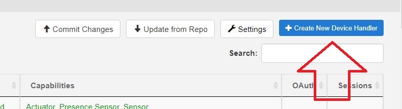
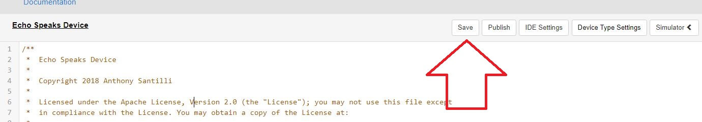

### <h3 style="color: #FF6025;">Step 1:</h3>
Log into the IDE.

* Click on the **`My Device Handlers`** tab:

    

* Followed by the **`Create New Device Handler`**:

    

* Finally the `From Code` tab:

    

---
### <h3 style="color: #FF6025;">Step 2:</h3>
Click on this link: [**Device Handler Code**](https://raw.githubusercontent.com/tonesto7/echo-speaks/master/devicetypes/tonesto7/echo-speaks-device.src/echo-speaks-device.groovy) to obtain the Device Handler code.

* Press `CTRL+A` to Select all text and `CTRL+C` to Copy the selected text.
* Now paste it into the large white box on your screen with `CTRL+V`. 
* Scroll to the bottom of the page and click on the ***`Create`*** button.

    

---
### <h3 style="color: #FF6025;">Step 3:</h3>

* Scroll to the top of the screen and click the **`Save`** button.

    

* Click on by the **`Publish`** button and then **`For Me`**.

    

---
### <h3 style="color: #FF6025;">Step 4:</h3>
Continue SmartApp Configuration Here:

[SmartApp Configuration](/echo-speaks-docs/configuration/smartthings/config_app)
