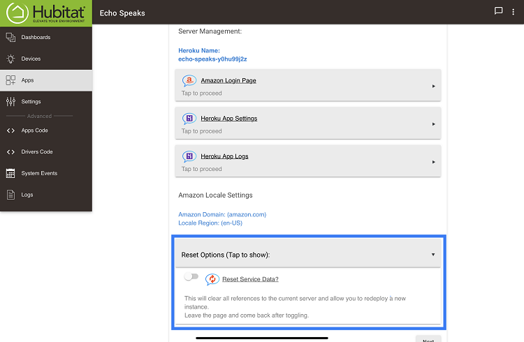
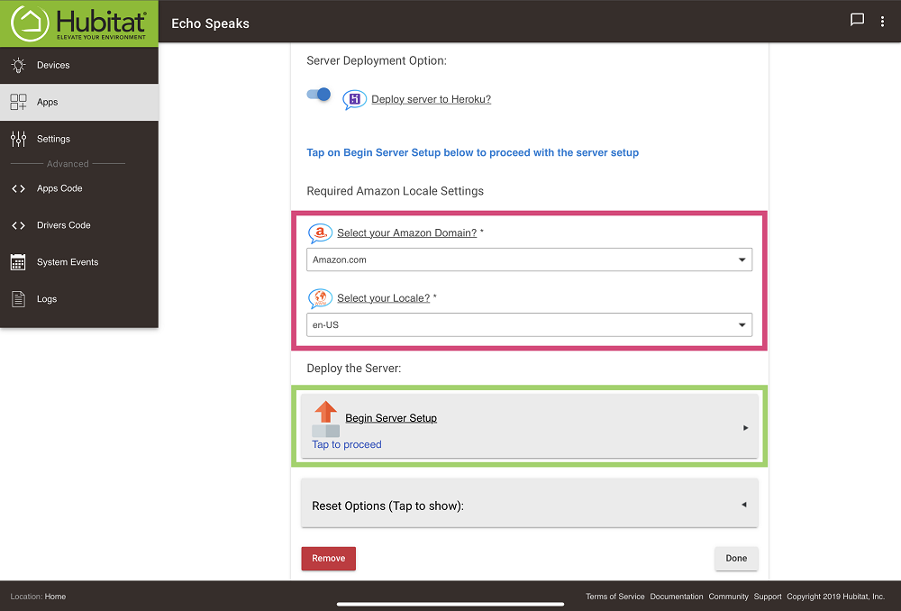

---
### <h3 style="color: #FF6025;">Step 5:</h3>
Open the Echo Speaks SmartApp and click on the **Login Status | Service Management**.

---
### <h3 style="color: #FF6025;">Step 6:</h3>
Tap on the **Manage Login Service** input at the bottom of the page.

  

---
### <h3 style="color: #FF6025;">Step 7:</h3>
At the bottom, you will see the **Reset Options** tap to expand the section.

* Once expanded Toggle the **Reset Service Data**

  

---
### <h3 style="color: #FF6025;">Step 8:</h3>
* If the page doesn't refresh to look like below then go back one page and return.

  

Now that you have deleted the Echo Speaks server and reset the service data from the app the removal process is complete.

---

### <h3 style="color: #FF6025;">Want to Redeploy?</h3>

[Server Configuration](/echo-speaks-docs/configuration/hubitat/config_server)
