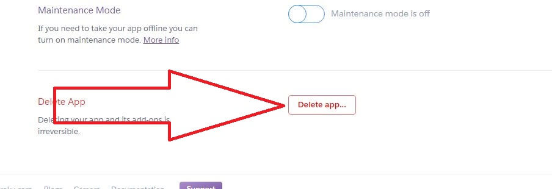

**There may come a time when you need to reset your Heroku server service.  Follow these steps precisely to do it.**

---
### <h3 style="color: #FF6025;">Step 1:</h3>
Logon to the dashboard.heroku.com site. You should see this screen that lists your Echo Speaks App, click on the app.
  

---
### <h3 style="color: #FF6025;">Step 2:</h3>
Click on the ***Settings*** button like you see in the green box below:

---
### <h3 style="color: #FF6025;">Step 3:</h3>
Scroll to the very bottom of the page and click on ***Delete App***

---
### <h3 style="color: #FF6025;">Step 4:</h3>
Copy and paste the name of the app into the block and click on Delete. Now close this screen and go back to your mobile app.

---
Select your platform to continue the removal/reset process:

 [SmartThings](/echo-speaks-docs/support/st_server_removal)

 [Hubitat](/echo-speaks-docs/support/he_server_removal)
